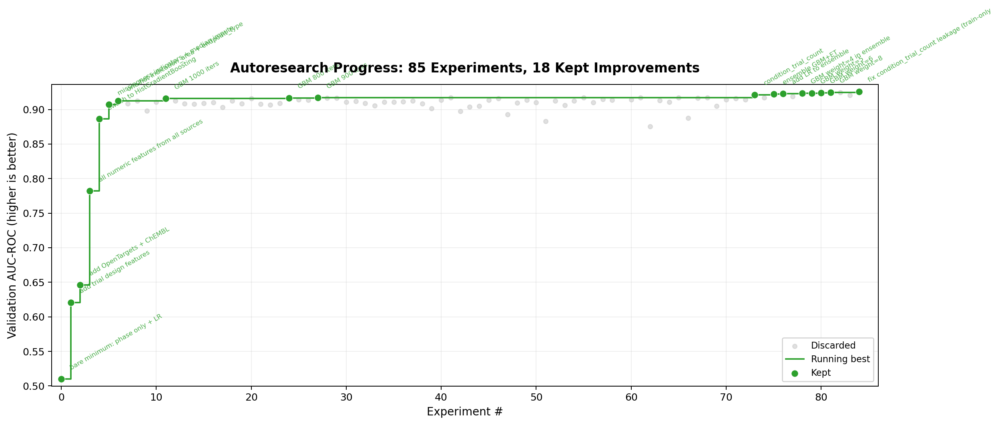

# ct-predict

Clinical trial outcome predictor. Given a dataset of Phase 2/3 clinical trials with biomedical features, an autonomous ML agent optimizes a model to predict success or failure.

Uses the [autoresearch](https://github.com/karpathy/autoresearch) pattern — an AI agent modifies `train.py`, trains, evaluates, keeps improvements, discards regressions, and repeats.

## Results

Starting from a single feature (phase) and logistic regression (**AUC-ROC 0.51**), the agent ran 85 experiments and reached **AUC-ROC 0.926** on a held-out validation set — 18 improvements kept, 66 discarded, 1 crash.



### Key milestones

| Exp | AUC-ROC | What changed |
|-----|---------|-------------|
| 0 | 0.510 | Baseline: `phase` only + LogisticRegression |
| 1 | 0.621 | Add 9 trial design features |
| 2 | 0.646 | Add OpenTargets + ChEMBL features |
| 3 | 0.782 | Add all 106 numeric features from 18 data sources |
| 4 | 0.886 | Switch to HistGradientBoostingClassifier |
| 5 | 0.907 | Missingness indicators + median imputation |
| 6 | 0.913 | One-hot encode indication area + endpoint type |
| 27 | 0.917 | Tune GBM iterations (900) |
| 73 | 0.921 | Add `condition_trial_count` feature |
| 75-81 | 0.925 | Ensemble (GBM + ExtraTrees + LR), tune weights |
| 85 | **0.926** | Fix condition_trial_count leakage (train-only) |

### What worked

- **Missingness indicators** — the single biggest feature engineering win (+0.02 AUC). Whether a data source has data for a trial is itself a strong signal.
- **condition_trial_count** — how many trials in the dataset target the same condition. Broke through a plateau at experiment 73.
- **Ensemble** (HistGBM + ExtraTrees + LogisticRegression) — the ensemble only helped once the features were good enough; earlier attempts with fewer features made it worse.
- **HistGBM hyperparameters** — `max_iter=900, depth=5, lr=0.05, leaf=16, l2=1.0` is a sharp optimum. Small changes in any direction degrade performance.

### What didn't work

- Log transforms, squared terms, rank features — trees learn these splits natively
- Feature interactions (score x phase, etc.) — added noise, trees already capture these
- Feature selection (mutual information) — removed useful signal
- Stacking, bagging — slower and worse than a simple VotingClassifier
- Most additional categorical encodings (sponsor, masking, allocation, intervention type)
- Class rebalancing (sample weights) — mild imbalance (62% positive) handled fine by GBM

## Quick start

```bash
# Train the model
python train.py

# Evaluate on held-out set
python prepare.py

# Run autoresearch (autonomous optimization)
claude -p "$(cat program.md)"

# Plot progress
python plot_progress.py
```

## How it works

`train.py` is the only mutable file. The autoresearch agent modifies it — trying different feature engineering, models, and hyperparameters. `prepare.py` evaluates on a frozen held-out set. Git tracks every experiment: improvements are committed, regressions are reverted.

## Dataset

2,151 real Phase 2/3 clinical trials across 8 therapeutic areas (oncology, CNS, immunology, metabolic, cardiovascular, respiratory, infectious, other).

**106 numeric features** from 18 biomedical data sources:

| Source | Features |
|--------|----------|
| ClinicalTrials.gov | Phase, enrollment, arms, sites, endpoints, DMC, biomarker selection |
| OpenTargets | Overall score, tractability, genetic/somatic/literature scores |
| ChEMBL | Selectivity, IC50, assay count, max phase, MoA count |
| DrugBank | Interactions, targets, enzymes, transporters, half-life, MW |
| BindingDB | Ki, Kd, measurement count |
| FDA | Prior approvals, breakthrough/fast track/orphan designations, AE count |
| PubMed + OpenAlex + bioRxiv | Publication counts, citation velocity, preprints |
| Medicare + Medicaid | Healthcare spend on indication |
| Reactome + STRING-db | Pathway count, PPI degree, betweenness |
| GTEx + gnomAD | Tissue specificity, pLI, LOEUF |
| ClinVar + GWAS Catalog | Pathogenic variants, GWAS hits |
| DepMap + cBioPortal | Cancer essentiality, mutation frequency |
| PubChem | Molecular descriptors (complexity, H-bond, XLogP) |
| PDB + AlphaFold | Structure count, ligand binding, confidence |
| Others | BRENDA kinetics, COSMIC drivers, KEGG/GO pathways, HPO phenotypes |

Plus combination drug features (drug2 evidence, target interactions, GO overlap) and trial metadata (indication area, endpoint type).

## Final model

**VotingClassifier** (soft voting):
- HistGradientBoostingClassifier (weight 8): 900 iters, depth 5, lr 0.05
- ExtraTreesClassifier (weight 1): 400 trees, depth 12
- LogisticRegression (weight 1): C=1.0

**220 features** after missingness indicators and one-hot encoding.

## Files

```
ct-predict/
├── program.md         # Agent instructions (the research program)
├── train.py           # Feature engineering + model (agent modifies this)
├── prepare.py         # Evaluation (frozen — DO NOT MODIFY)
├── predict.py         # Predict trials in the dataset
├── plot_progress.py   # Generate progress.png from results.tsv
├── progress.png       # Autoresearch progress chart
├── results.tsv        # Full experiment log (85 experiments)
└── data/
    ├── trials.csv     # 2,151 trials × 125 columns
    └── val_ids.json   # Held-out validation split
```
